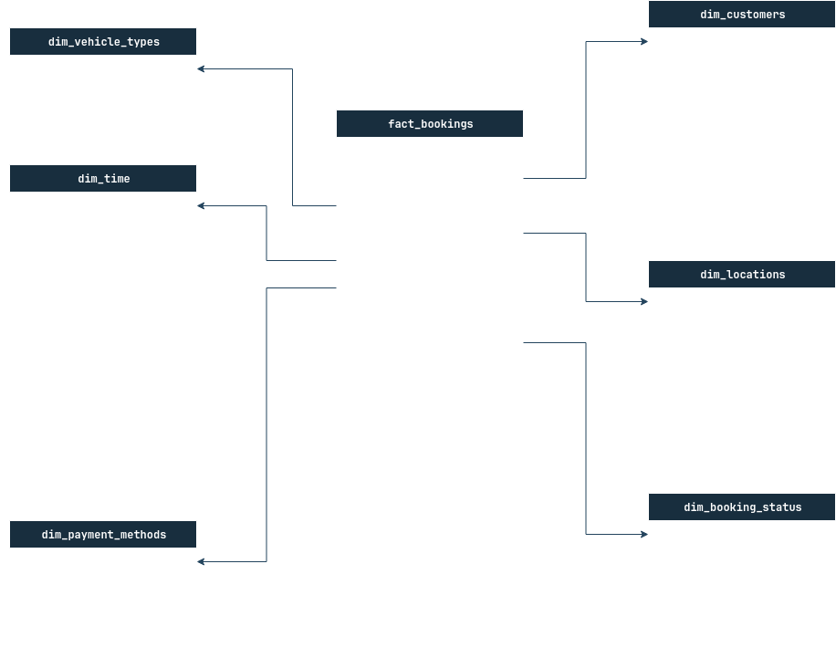

# 🚘 Uber Data Analytics 2024.

## 📌 Project Overview.

This project focuses on analyzing Uber trip data to uncover patterns in demand, revenue, and driver performance. The objective is to design an end-to-end data analytics pipeline that transforms raw trip data into actionable insights for business decision-making.

Using Python, I developed and ETL process to clean and load over **148k records** into a PostgreSQL database (in Docker). I implemented a star schema to improve query efficiency and simplify reporting logic. SQL queries were used to define key performance indicators such as **total bookings, revenue and cancellation rate**.

Theses metrics were visualized in a [Power BI dashboard]() highlighting trends in demand by time, location, and driver, enabling insights into **peak operating hours, revenue optimization, and cancellation impact**. The project demonstrates the complete workflow of transforming raw into meaningful business intelligence.

---

## Data Schema

### Staging Table

- `booking_id`: Unique identifier for each ride booking.
- `booking_status`: Status of booking (Completed, Cancelled by Customer, Cancelled by Driver, etc.).
- `customer_id`: Unique identifier for customers.
- `vehicle_type`: Type of vehicle (Go Mini, Go Sedan, Auto, eBike/Bike, UberXL, Premier Sedan).
- `pick_up_location`: Starting location of the ride.
- `drop_location`: Destination location of the ride.
- `avg_vtat`: Average time for driver to reach pickup location (in minutes).
- `avg_ctat`: Average trip duration from pickup to destination (in minutes).
- `cancelled_by_customer`: Customer-initiated cancellation flag.
- `customer_cancellation_reason`: Reason for customer cancellation.
- `cancelled_by_driver`: Driver-initiated cancellation flag.
- `driver_cancellation_reason`: Reason for driver cancellation
- `incomplete_rides`: Incomplete ride flag
- `incomplete_rides_reason`: Reason for incomplete rides
- `booking_value`: Total fare amount for the ride
- `ride_distance`: Distance covered during the ride (in km)
- `driver_rating`: Rating given to driver (1-5 scale)
- `customer_rating`: Rating given by customer (1-5 scale)
- `payment_method`: Method used for payment (UPI, Cash, Credit Card, Uber Wallet, Debit Card)
- `booking_timestamp`: Timestamp of the booking.

### Star Schema



---

## 🚀 Tech Stack

- **Database:** PostgreSQL (running in Docker).
- **ETL Job:** Python script (running in Docker).
- **Queries:** SQL.
- **Visualization:** Power BI.

---

## 🎯 Business Problem


---

## 📊 KPIs and metrics

### Performance

1. **Total Bookings and Total Completed Bookings** - 
2. **Total and Percentage Incompleted Bookings** - 
3. **Total and Percentage Cancelled Rides**
4. **Total Bookings and Total Bookings Where Driver Was Not Found**

### Financial

1. **Total Revenue**
2. **AVG Revenue**
3. **Revenue per Customer**

### Customer Behavior

1. **Customer Segmentation**
2. **Avg Customer Rating**
3. **Avg Driver Rating**

### Operational Efficiency

1. **Avg Ride Distance**
2. **Avg VTAT**
3. **Avg CTAT**
4. **Bookings by Quarter**
5. **Bookings by Month**
6. **Bookings by DOW**
7. **Bookings by Time of Day**

### Categorical Insights

1. **Bookings by Vehicle Type**
2. **Bookings by Payment Method**
3. **Bookings by Status Category**
4. **Reason to Cancel of Customer**

---

## ⚙️ Local Setup Instructions

### Prerequisites

- Docker & Docker Compose

1. **Clone the repo**

```bash
git clone https://github.com/AaronOrtega1/SQL-PowerBI-Project.git
cd SQL-PowerBI-Project
```

2. **Create a .env file in the root of the folder with the next information**

```env
POSTGRES_DB=uber_db
POSTGRES_USER=uber_user
POSTGRES_PASSWORD=uber_passwordd
```

3. **Start PostgreSQL and ETL job with Docker**

```bash
docker compose up -d
```

4. **The `docker-compose.yml` file automatically creates the Database.**
5. **Then a Python script runs that preprocess the data and loads it into a `staging_bookings` table.**
6. **Then the Python script uses the data loaded into the staging table to create a star schema to have simpler queries and simplified Business Reporting logic.**
7. **To create a dashboard of your own, you have to connect the PostgreSQL DB to Power BI desktop also using the information in the `.env` file.**

---

## 📷 Screenshots


## 👤 Author

- [Francisco Aarón Ortega Anguiano](https://www.linkedin.com/in/francisco-aar%C3%B3n-ortega-anguiano-63109022a/) – Computer Systems Engineering Student
